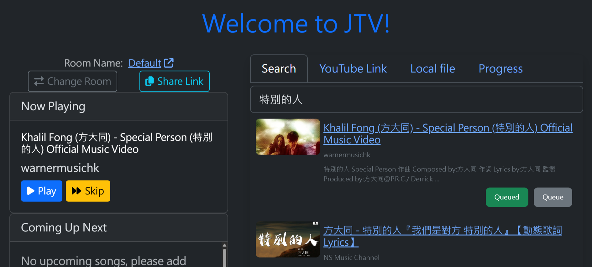
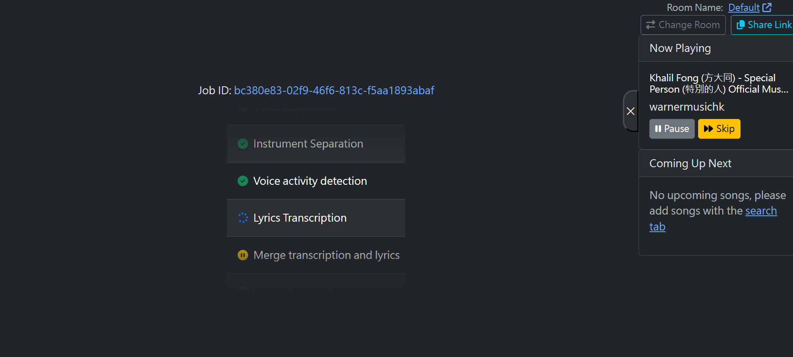
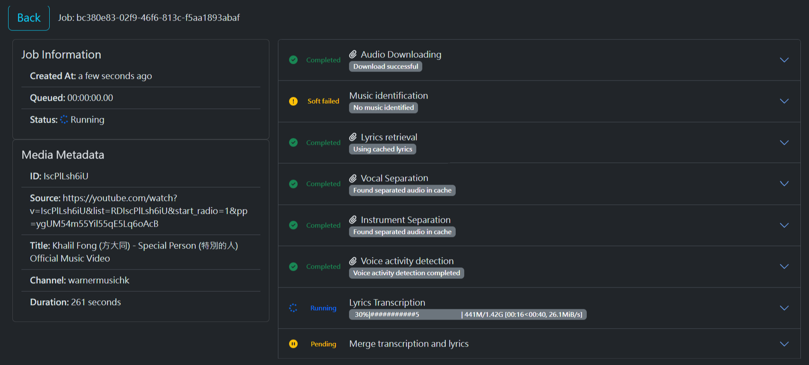

# JTV: All-In-One karaoke System

This is a scalable, comprehensive karaoke system that allows you to search for any song on YouTube, generate a corresponding karaoke version, and start singing in seconds.

## Architecture
The system consists of these components:
1. [Scheduler](karaoke/scheduler/): This component handles the generation job queue, manages the status of jobs, and distributes them to available workers.
2. [Worker](karaoke/worker/): Execute karaoke songs generation.
3. [Frontend web application](frontend/): Search, choose and play karaoke songs.
4. [Web Server](karaoke/web_server/): Serving frontend app and backend apis

## How to use
1. Search: You use the frontend web application to search for a song on YouTube.

    [](images/1-search.png)

2. Request: The frontend sends a request to the web server to generate a karaoke version of the selected song.

    [](images/2-request.png)

3. Schedule & process: The scheduler assigns the job to an available worker. The worker then processes the song, generating the necessary karaoke files.

    [](images/3-schedule.png)

4. Enjoy: Once the generation is complete, the frontend automatically loads the newly created karaoke song, allowing you to start singing!

    [](images/4-sing.png)

## Installation
To get JTV up and running, you'll need to set up each of the components. The system is modular, each component can be installed and run independently.
1. Clone the Repository
First, clone the JTV repository to your local machine for each components:
```
git clone https://github.com/JC-comp/karaoke/
cd karaoke
```
2. Configure the System
The system uses a config.ini file for global settings. Copy a config.ini from `config.ini.example` at the root of the cloned. If your system is not on the same machine, you will need to set the scheduler host information accordingly.
3. Install
Each component requires common installation first.
```
pip install -r requirements-base.txt
```

4. Install and run each Component
After configured common settings for all components, each component has its own installation steps.
### Scheduler
Run the the master scheduler.
```
python -m karaoke.scheduler.master.main
```
### Worker
```
pip install -r karaoke/worker/requirements-base.txt
# Install GPU support dependencies or CPU only
# pip install -r karaoke/worker/requirements-gpu.txt # GPU support
pip install -r karaoke/worker/requirements-cpu.txt # CPU only
/app/venv/bin/python -m karaoke.scheduler.slave
```
### Web Server
Install dependencies and run the webserver.
```
pip install -r karaoke/web_server/requirements.txt
gunicorn -k eventlet -b 0.0.0.0:8000 'karaoke.web_server.main:run_web()'
```