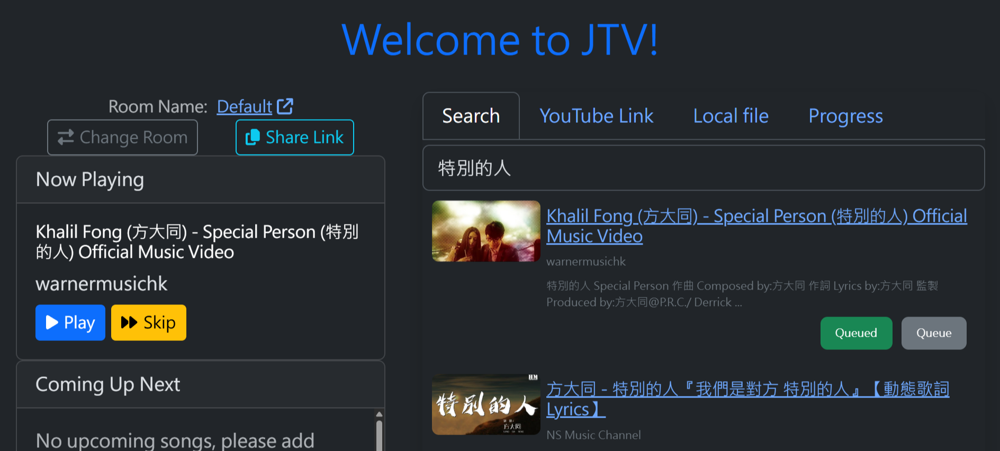
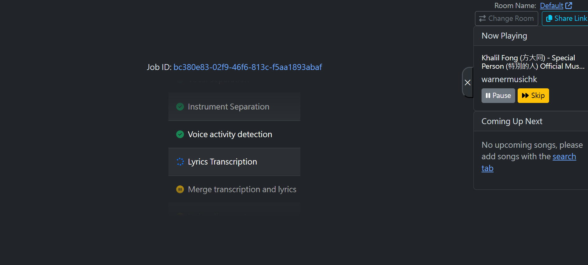
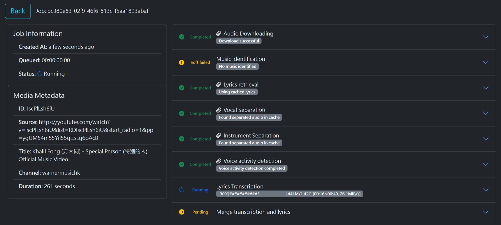

# JTV: All-In-One karaoke System

This is a scalable, comprehensive karaoke system that allows you to search for any song on YouTube, generate a corresponding karaoke version, and start singing in seconds.

## Architecture
The system is built with a decoupled microservices approach to handle heavy media processing without lagging the user interface.
### Core Components
* **Frontend UI (`ui/`)**: A **Next.js** web application where users can search, select, and play karaoke tracks.
* **Web Server (`api/`)**: The central hub that serves the frontend and handles backend API requests (user management, song metadata, and job triggering).
* **Scheduler & Worker (`karaoke/`)**: Powered by **Apache Airflow**. This component manages the generation job queue, tracks job status (Processing/Finished/Failed), and distributes intensive tasks (like AI vocal separation) to available workers.

## How to use
1. Search: You use the frontend web application to search for a song on YouTube.

    [](images/1-search.png)

2. Request: The frontend sends a request to the web server to generate a karaoke version of the selected song.

    [](images/2-request.png)

3. Schedule & process: The scheduler assigns the job to an available worker. The worker then processes the song, generating the necessary karaoke files.

    [](images/3-schedule.png)

4. Enjoy: Once the generation is complete, the frontend automatically loads the newly created karaoke song, allowing you to start singing!

    [](images/4-sing.png)

## Getting Started
1.  **Clone the repository**:
    ```bash
    git clone https://github.com/JC-comp/karaoke
    cd karaoke
    ```
2.  **Configure Environment Variables**:
    Copy the example file and fill in your specific keys (API keys, Database credentials, etc.).
    ```bash
    cp example.env .env
    ```

3.  **Launch the System**:
    ```bash
    docker compose up -d
    ```

4.  **Access the Application**:
    Once the Docker containers are healthy, you can reach the interfaces through your web browser:\
    User Interface: http://localhost:8000 

---

## 🛠 Tech Stack

| Component | Technology |
| :--- | :--- |
| **Frontend** | Next.js, Tailwind CSS |
| **API** | Python / Flask |
| **Orchestration** | Apache Airflow |
| **Containerization** | Docker, Docker Compose |
| **Processing** | FFmpeg, AI Vocal Remover Models |

---